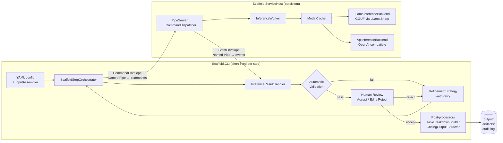

# DevScaffold

A human-in-the-loop, YAML-configured development workflow tool for .NET projects. The human decides when each step runs, reviews every AI-generated output, and either accepts, edits, or rejects it — the AI generates, the human controls.

## Why This Exists

Most AI coding tools aim to automate decisions. This project takes the opposite position: AI output is fast but untrustworthy without review, and an experienced developer's judgment is not a bottleneck to eliminate. The result is a workflow where LLM inference handles the generation work while every output checkpoint remains under explicit human control — with a full audit trail of what was generated, what was rejected, and why.

---

## Architecture Overview



Two independent processes communicate over **two unidirectional Named Pipes** using Protocol Buffers with varint length-prefix framing. The CLI is short-lived (one step, then exit); the ServiceHost stays running between steps to keep models in memory.

---

## Key Design Decisions

- **The CLI runs one step, then exits. The human is the orchestrator.** There is no `pipeline.yaml`, no automated step chaining. Each `DevScaffold --step` invocation is independent — the human decides what runs next, with what input, and when. This was a deliberate departure from the original `PipelineRunner` design which tried to automate step sequencing. → [ADR-CLI](DevScaffold/Scaffold.CLI/ADR-CLI.md)

- **Two-process split to avoid model reload latency.** Loading a GGUF model on CPU takes 30–60 seconds. The ServiceHost runs in the background and caches loaded models in memory across CLI invocations. The CLI starts instantly. → [ADR-ServiceHost](DevScaffold/Scaffold.ServiceHost/ADR-ServiceHost.md)

- **Named Pipes with protobuf envelopes, not a shared database or file-based queue.** Two unidirectional pipes with `CommandEnvelope`/`EventEnvelope` wrappers give clean ownership, type-safe dispatch via `oneof`, and efficient varint framing — without introducing a broker or shared state. Every request carries a `request_id` GUID for async correlation across the async pipes. → [ADR-Protocol](DevScaffold/Scaffold.Agent.Protocol/ADR-Protocol.md)

- **Automatic validation runs before human review, not instead of it.** Two validation layers (universal stop-token/truncation detection + per-step structural validators) filter out malformed outputs automatically. When validation fails, a targeted refinement prompt is retried without involving the human. The human only sees output that passed automatic checks. → [ADR-CLI](DevScaffold/Scaffold.CLI/ADR-CLI.md)

- **Rejected output is not fed back to the model.** On rejection, the refinement prompt contains the original input and the human's clarification — not the rejected text. Feeding bad output back causes the model to patch rather than rethink. The rejected file stays on disk for the human to inspect. → [ADR-CLI](DevScaffold/Scaffold.CLI/ADR-CLI.md)

- **Fire-and-forget inference in the ServiceHost.** `CommandDispatcher` starts inference with `Task.Run` without awaiting it. This keeps the command pipe responsive — `CancelInferRequest` can only arrive if the command loop is running. → [ADR-ServiceHost](DevScaffold/Scaffold.ServiceHost/ADR-ServiceHost.md)

---

## Tech Stack

- **.NET 10**, C# — CLI and ServiceHost
- **LLamaSharp** — local GGUF inference (wraps llama.cpp); chosen for on-premise, API-free operation
- **OpenAI-compatible HTTP API** — remote backend alternative (OpenAI, Azure, Ollama, LM Studio, vLLM)
- **Protocol Buffers (protobuf-net / Google.Protobuf)** — IPC serialization
- **Named Pipes** — local IPC transport (no network stack required)
- **YamlDotNet** — YAML config parsing
- **Microsoft.Extensions.DependencyInjection** — composition root in both processes

---

## Project Status

**In Progress / MVP complete.**

Working end-to-end:
- Two-process architecture with Named Pipe IPC
- Local GGUF inference (LLamaSharp) and OpenAI-compatible API backend
- Human validation loop with auto-retry on failure
- Audit log per generation
- Post-processing: task breakdown splitting (`tasks/`), code artifact extraction (`artifacts/`)
- `--apply` command to copy accepted artifacts into the target project
- `--input` flag for per-task secondary input

Not yet implemented:
- Automated test suite
- Token-by-token streaming to the CLI
- Web-based human validation UI

---

## Getting Started

**Prerequisites:** .NET 10 SDK, and either a GGUF model file (e.g. [Qwen2.5-7B-Instruct](https://huggingface.co/Qwen/Qwen2.5-7B-Instruct-GGUF)) or an OpenAI-compatible API endpoint.

**1. Configure the CLI** — create `Scaffold.CLI.yaml` next to the `DevScaffold` executable:

```yaml
host_binary_path: ./bin/Scaffold.ServiceHost
models:           ./models.yaml
pipe_name:        MyProject
output:           ./output
project_context:  ./input.yaml
project_root:     ../MyActualProject/   # required for --apply

steps:
  task_breakdown:
    input_config:  ./steps/task_breakdown_agent.yaml
    model_alias:   qwen2.5-7b-instruct
  coding:
    input_config:  ./steps/coding_agent.yaml
    model_alias:   qwen2.5-coder-7b-instruct
```

**2. Configure models** — `models.yaml`:

```yaml
models:
  qwen2.5-7b-instruct:
    path: D:/models/qwen2.5-7b-instruct-q4_k_m.gguf
    context_size: 8192
    gpu_layer_count: 0

  gpt-4o-via-api:
    path: https://api.openai.com/v1
    api_key_env: OPENAI_API_KEY
    model_id: gpt-4o
```

**3. Run a step:**

```bash
DevScaffold --step task_breakdown
DevScaffold --step coding --input ./tasks/task_01.yaml
DevScaffold --apply coding_1 --dry-run   # preview artifact copy
DevScaffold --apply coding_1             # copy to project_root
DevScaffold shutdown
```

The CLI starts the ServiceHost automatically on the first `--step` invocation.

**Exit codes:** `0` = accepted, `1` = error, `2` = rejected — scriptable via `$?`.

**Build from source:**

```bash
dotnet build DevScaffold/DevScaffold.slnx
```

---

## License

Apache License 2.0 — see [LICENSE](LICENSE) for details.
