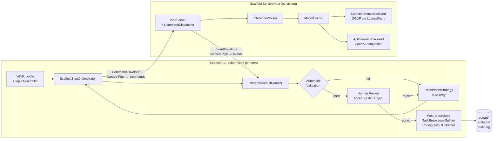
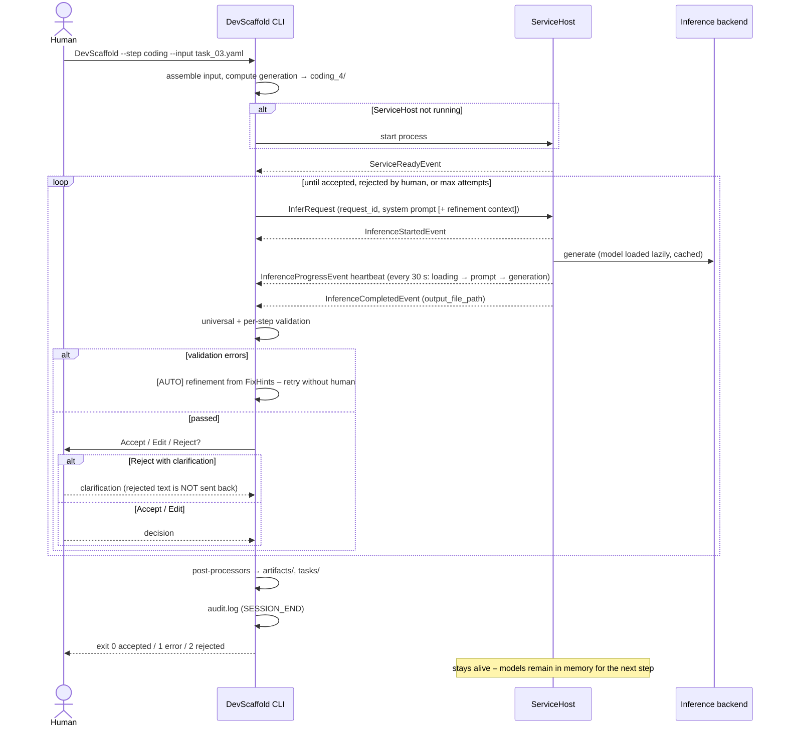

# DevScaffold

[](https://github.com/vvidman/Dev_Scaffold/actions/workflows/ci.yml)


A human-in-the-loop, YAML-configured development workflow tool for .NET projects. The human decides when each step runs, reviews every AI-generated output, and either accepts, edits, or rejects it — the AI generates, the human controls.

> **Naming.** *Scaffold Protocol* is the workflow concept: step-based,
> human-orchestrated AI generation with explicit review checkpoints.
> *DevScaffold* is this repository's implementation of it (CLI + ServiceHost).

## Why This Exists

Most AI coding tools aim to automate decisions. This project takes the opposite position: AI output is fast but untrustworthy without review, and an experienced developer's judgment is not a bottleneck to eliminate. The result is a workflow where LLM inference handles the generation work while every output checkpoint remains under explicit human control — with a full audit trail of what was generated, what was rejected, and why.

---

## Reading Guide for Reviewers

If you have ten minutes, read in this order:

1. **This README** – the design decisions and the trade-offs below.
2. **[ADR-Protocol](DevScaffold/Scaffold.Agent.Protocol/ADR-Protocol.md)** – the IPC contract: envelopes, correlation, framing.
3. **[ADR-ServiceHost](DevScaffold/Scaffold.ServiceHost/ADR-ServiceHost.md)** – process lifecycle, model cache, concurrency, the fire-and-forget failure path.
4. **[ADR-CLI](DevScaffold/Scaffold.CLI/ADR-CLI.md)** – why the CLI is step-scoped, and how the design evolved through four refactor rounds.
5. **[ADR-Validation](DevScaffold/Scaffold.Validation/ADR-Validation.md)** – where automation stops and human judgment starts.
6. **[specs/](specs/)** – the task files this code was implemented from.

Code entry points: `Scaffold.Application/ScaffoldStepOrchestrator.cs` (the retry loop),
`Scaffold.ServiceHost/CommandDispatcher.cs` (command routing), `Scaffold.Tests/` (the decisions, pinned as tests).

---

## Architecture Overview


```mermaid
flowchart LR
    subgraph CLI ["Scaffold.CLI (short-lived per step)"]
        A[YAML config\n+ InputAssembler] --> B[ScaffoldStepOrchestrator]
        B --> C[InferenceResultHandler]
        C --> D{Automatic\nValidation}
        D -- fail --> E[RefinementStrategy\nauto-retry]
        D -- pass --> F[Human Review\nAccept / Edit / Reject]
        F -- reject --> E
        E --> B
        F -- accept --> G[Post-processors\nTaskBreakdownSplitter\nCodingOutputExtractor]
    end

    subgraph SH ["Scaffold.ServiceHost (persistent)"]
        H[PipeServer\n+ CommandDispatcher] --> I[InferenceWorker]
        I --> J[ModelCache]
        J --> K[LlamaInferenceBackend\nGGUF via LLamaSharp]
        J --> L[ApiInferenceBackend\nOpenAI-compatible]
    end

    B -- CommandEnvelope\nNamed Pipe → commands --> H
    H -- EventEnvelope\nNamed Pipe → events --> C

    G --> M[(output/\nartifacts/\naudit.log)]
```

Two independent processes communicate over **two unidirectional Named Pipes** using Protocol Buffers with varint length-prefix framing. The CLI is short-lived (one step, then exit); the ServiceHost stays running between steps to keep models in memory.

---

### Step Lifecycle

One `DevScaffold --step` invocation, including an automatic rejection and a human decision:


```mermaid
sequenceDiagram
    actor Human
    participant CLI as DevScaffold CLI
    participant SH as ServiceHost
    participant LLM as Inference backend

    Human->>CLI: DevScaffold --step coding --input task_03.yaml
    CLI->>CLI: assemble input, compute generation → coding_4/
    alt ServiceHost not running
        CLI->>SH: start process
    end
    SH-->>CLI: ServiceReadyEvent

    loop until accepted, rejected by human, or max attempts
        CLI->>SH: InferRequest (request_id, system prompt [+ refinement context])
        SH-->>CLI: InferenceStartedEvent
        SH->>LLM: generate (model loaded lazily, cached)
        SH-->>CLI: InferenceProgressEvent heartbeat (every 30 s: loading → prompt → generation)
        SH-->>CLI: InferenceCompletedEvent (output_file_path)
        CLI->>CLI: universal + per-step validation
        alt validation errors
            CLI->>CLI: [AUTO] refinement from FixHints – retry without human
        else passed
            CLI->>Human: Accept / Edit / Reject?
            alt Reject with clarification
                Human-->>CLI: clarification (rejected text is NOT sent back)
            else Accept / Edit
                Human-->>CLI: decision
            end
        end
    end

    CLI->>CLI: post-processors → artifacts/, tasks/
    CLI->>CLI: audit.log (SESSION_END)
    CLI-->>Human: exit 0 accepted / 1 error / 2 rejected
    Note over SH: stays alive – models remain in memory for the next step
```

---

## Key Design Decisions

- **The CLI runs one step, then exits. The human is the orchestrator.** There is no `pipeline.yaml`, no automated step chaining. Each `DevScaffold --step` invocation is independent — the human decides what runs next, with what input, and when. This was a deliberate departure from the original `PipelineRunner` design which tried to automate step sequencing. → [ADR-CLI](DevScaffold/Scaffold.CLI/ADR-CLI.md)

- **Two-process split to avoid model reload latency.** Loading a GGUF model on CPU takes 30–60 seconds. The ServiceHost runs in the background and caches loaded models in memory across CLI invocations. The CLI starts instantly. → [ADR-ServiceHost](DevScaffold/Scaffold.ServiceHost/ADR-ServiceHost.md)

- **Named Pipes with protobuf envelopes, not a shared database or file-based queue.** Two unidirectional pipes with `CommandEnvelope`/`EventEnvelope` wrappers give clean ownership, type-safe dispatch via `oneof`, and efficient varint framing — without introducing a broker or shared state. Every request carries a `request_id` GUID for async correlation across the async pipes. → [ADR-Protocol](DevScaffold/Scaffold.Agent.Protocol/ADR-Protocol.md)

- **Automatic validation runs before human review, not instead of it.** Two validation layers (universal stop-token/truncation detection + per-step structural validators) filter out malformed outputs automatically. When validation fails, a targeted refinement prompt is retried without involving the human. The human only sees output that passed automatic checks. → [ADR-CLI](DevScaffold/Scaffold.CLI/ADR-CLI.md)

- **Rejected output is not fed back to the model.** On rejection, the refinement prompt contains the original input and the human's clarification — not the rejected text. Feeding bad output back causes the model to patch rather than rethink. The rejected file stays on disk for the human to inspect. → [ADR-CLI](DevScaffold/Scaffold.CLI/ADR-CLI.md)

- **Validators check necessary conditions, never sufficient ones.** A validator failure means the output is certainly wrong; a pass only means it *may* be right — content correctness is always a human decision. No LLM-as-judge for content. → [ADR-Validation](DevScaffold/Scaffold.Validation/ADR-Validation.md)

- **Fire-and-forget inference in the ServiceHost.** `CommandDispatcher` starts inference with `Task.Run` without awaiting it. This keeps the command pipe responsive — `CancelInferRequest` can only arrive if the command loop is running. → [ADR-ServiceHost](DevScaffold/Scaffold.ServiceHost/ADR-ServiceHost.md)

---

## Tech Stack

- **.NET 10**, C# — CLI and ServiceHost
- **LLamaSharp** — local GGUF inference (wraps llama.cpp); chosen for on-premise, API-free operation
- **OpenAI-compatible HTTP API** — remote backend alternative (OpenAI, Azure, Ollama, LM Studio, vLLM)
- **Protocol Buffers (Google.Protobuf, code generated by Grpc.Tools – no gRPC runtime)** — IPC serialization
- **Named Pipes** — local IPC transport (no network stack required)
- **YamlDotNet** — YAML config parsing
- **Microsoft.Extensions.DependencyInjection** — composition root in both processes

---

## Trade-offs and Known Limitations

These are deliberate choices for a single-developer, local-first tool. Each one
would be revisited before multi-user or server deployment.

| Area | Current choice | Cost / what would change at scale |
|---|---|---|
| Trust boundary | Named Pipes on the local machine; no authentication, no pipe ACL | Any local process running as the same user can connect. Multi-user use would need pipe security descriptors or a socket transport with auth. |
| Concurrency | One inference at a time (`SemaphoreSlim(1,1)`), a second request is rejected with `InferenceFailedEvent` | Right for CPU-only inference; a GPU or remote backend would benefit from a queue and per-request cancellation (the `CancelInferRequest` contract already carries `request_id`). |
| Protocol versioning | `ServiceReadyEvent.version` is sent but not checked by the CLI | A CLI/ServiceHost version mismatch is not detected. Next step: compare major versions on connect and fail fast. |
| State | The filesystem is the state store (generation numbering, audit logs) | Simple and restart-safe, but two CLIs running the same step concurrently could race on the generation number. Acceptable with one human orchestrator. |
| `--apply` | Always overwrites; mitigated by `--dry-run` and path validation | No backup or VCS integration. At scale: apply onto a git branch and let the human review the diff. |
| Truncation detection | Heuristic on the last line (`TRUNCATED_OUTPUT`) | Can produce false positives/negatives. Consistent with the principle that validators only check necessary conditions – a false positive costs one retry. |
| Retry budget | Max 5 attempts per step, hard-coded | Should become a per-step config value. |
| Progress feedback | Progress events every 30 s, no token streaming | Deliberate: the workflow is file-based review, not interactive chat. |
| Liveness | The ServiceHost sends a heartbeat (`InferenceProgressEvent`) every 30 s for the whole request – model load, prompt processing, generation. The CLI fails the step after 90 s (3 missed heartbeats) of silence for its `request_id` and sends a best-effort `CancelInferRequest`. The timer is suspended during human review. | Cancellation is cooperative: a native llama.cpp call (model load, a prefill batch) only stops at its next cancellation check, and a truly hung ServiceHost still needs `DevScaffold shutdown`. The interval is fixed; a remote/queued backend would need it configurable. |
| Platform | Developed and run on Windows; shutdown detection uses the Windows pipe namespace (`\\.\pipe\`) | Linux/macOS run of the full tool is untested; CI runs build and unit tests on both. |
| Observability | Per-generation plain-text `audit.log` (key=value) | Parser-friendly but not aggregated. At scale: emit OpenTelemetry traces/metrics (attempts, violation rates, tok/s per step) instead of only files. |

---

## Project Status

**In Progress / MVP complete.**

Working end-to-end:
- Two-process architecture with Named Pipe IPC
- Local GGUF inference (LLamaSharp) and OpenAI-compatible API backend
- Human validation loop with auto-retry on failure
- Audit log per generation
- Post-processing: task breakdown splitting (`tasks/`), code artifact extraction (`artifacts/`)
- `--apply` command to copy accepted artifacts into the target project
- `--input` flag for per-task secondary input
- Unit tests for validators, refinement, input assembly, artifact handling,
  protocol framing and the ServiceHost failure path (`dotnet test DevScaffold/DevScaffold.slnx`)

Not yet implemented:
- Token-by-token streaming to the CLI
- Web-based human validation UI

---

## Development Process

The code was built with the same philosophy it implements. Architecture was
decided in discussion and recorded as ADRs; implementation was split into small,
dependency-ordered task files and executed by Claude Code; every change was
verified by live end-to-end runs. The task files are kept in [specs/](specs/)
as the original working record.

---

## Getting Started

**Prerequisites:** .NET 10 SDK, and either a GGUF model file (e.g. [Qwen2.5-7B-Instruct](https://huggingface.co/Qwen/Qwen2.5-7B-Instruct-GGUF)) or an OpenAI-compatible API endpoint.

**1. Configure the CLI** — copy `Scaffold.CLI.example.yaml` to `Scaffold.CLI.yaml` next to the `DevScaffold` executable and adjust the paths (the real file is git-ignored – it holds machine-specific paths):

```yaml
host_binary_path: ./bin/Scaffold.ServiceHost
models:           ./models.yaml
pipe_name:        MyProject
output:           ./output
project_context:  ./input.yaml
project_root:     ../MyActualProject/   # required for --apply

steps:
  task_breakdown:
    input_config:  ./steps/task_breakdown_agent.yaml
    model_alias:   qwen2.5-7b-instruct
  coding:
    input_config:  ./steps/coding_agent.yaml
    model_alias:   qwen2.5-coder-7b-instruct
```

**2. Configure models** — `models.yaml`:

```yaml
models:
  qwen2.5-7b-instruct:
    path: D:/models/qwen2.5-7b-instruct-q4_k_m.gguf
    context_size: 8192
    gpu_layer_count: 0

  gpt-4o-via-api:
    path: https://api.openai.com/v1
    api_key_env: OPENAI_API_KEY
    model_id: gpt-4o
```

**3. Run a step:**

```bash
DevScaffold --step task_breakdown
DevScaffold --step coding --input ./tasks/task_01.yaml
DevScaffold --apply coding_1 --dry-run   # preview artifact copy
DevScaffold --apply coding_1             # copy to project_root
DevScaffold shutdown
```

The CLI starts the ServiceHost automatically on the first `--step` invocation.

**Exit codes:** `0` = accepted, `1` = error, `2` = rejected — scriptable via `$?`.

**Build from source:**

```bash
dotnet build DevScaffold/DevScaffold.slnx
dotnet test DevScaffold/DevScaffold.slnx
```

---

## License

Apache License 2.0 — see [LICENSE](LICENSE) for details.
